# COREvia — Comprehensive UML Architecture & System Design Specification

This document provides the authoritative, implementation-grounded **Unified Modeling Language (UML)** and system architecture specification for the **COREvia Core Banking & Financial Relationship Intelligence Platform**. Every diagram, entity attribute, lifecycle state, service dependency, and interaction flow documented here has been directly verified against the active codebase.

---

## Table of Contents

1. [A. Project Overview & Architecture Foundation](#a-project-overview--architecture-foundation)
2. [B. UML Use-Case Diagram](#b-uml-use-case-diagram)
3. [C. UML Component Diagram & Layered Architecture](#c-uml-component-diagram--layered-architecture)
4. [D. UML Deployment Diagram](#d-uml-deployment-diagram)
5. [E. UML Class & Domain Diagrams](#e-uml-class--domain-diagrams)
   - [E.1 Identity & Access Governance Domain](#e1-identity--access-governance-domain)
   - [E.2 Core Banking & CRM Domain](#e2-core-banking--crm-domain)
   - [E.3 Digital Onboarding & Document Intelligence Domain](#e3-digital-onboarding--document-intelligence-domain)
   - [E.4 Relationship Intelligence & Network Topology Domain](#e4-relationship-intelligence--network-topology-domain)
   - [E.5 Decision Trace, Strategy Simulation & Action Governance Domain](#e5-decision-trace-strategy-simulation--action-governance-domain)
   - [E.6 Operations, API Gateway & Enterprise Integrations Domain](#e6-operations-api-gateway--enterprise-integrations-domain)
6. [F. UML Sequence Diagram — Enterprise Authentication](#f-uml-sequence-diagram--enterprise-authentication)
7. [G. UML Sequence Diagram — Controlled Banking Copilot Flow](#g-uml-sequence-diagram--controlled-banking-copilot-flow)
8. [H. UML Activity Diagram — Signal-to-Action Governance Lifecycle](#h-uml-activity-diagram--signal-to-action-governance-lifecycle)
9. [I. UML State Diagrams](#i-uml-state-diagrams)
   - [I.1 Service Case Dispute & Grievance Lifecycle](#i1-service-case-dispute--grievance-lifecycle)
   - [I.2 Commercial Opportunity Pipeline Lifecycle](#i2-commercial-opportunity-pipeline-lifecycle)
   - [I.3 Digital Onboarding & KYC/KYB Application Lifecycle](#i3-digital-onboarding--kyckyb-application-lifecycle)
   - [I.4 Operational Approval & Maker-Checker Dual-Control Lifecycle](#i4-operational-approval--maker-checker-dual-control-lifecycle)
   - [I.5 Relationship Signal Event Lifecycle](#i5-relationship-signal-event-lifecycle)
   - [I.6 Decision Trace & Governance Lifecycle](#i6-decision-trace--governance-lifecycle)
10. [J. Database Architecture & Relational Topology Summary](#j-database-architecture--relational-topology-summary)
11. [K. Security Boundaries & Defense-in-Depth Model](#k-security-boundaries--defense-in-depth-model)
12. [L. Integration Architecture & Adapter Classification](#l-integration-architecture--adapter-classification)
13. [M. Design Assumptions, System Invariants & Operational Limitations](#m-design-assumptions-system-invariants--operational-limitations)

---

## A. Project Overview & Architecture Foundation

**COREvia** is an institutional core banking relationship management and intelligence platform. It bridges traditional core banking transaction processing (CASA accounts, term deposits, retail lending, commercial credit lines) with advanced relationship intelligence (CORE score modeling, relationship digital twin, bounded BFS network topology graphs, automated customer journey orchestration, and AI-assisted decision explainability).

### Verified Technology Stack (Repository Ground Truth)

| Subsystem | Technology | Repository Version | Verified Function in COREvia |
|---|---|---|---|
| **Frontend Framework** | React | `^19.0.1` | Single Page Application (SPA) architecture with strict component isolation |
| **Frontend Tooling** | Vite | `^6.2.3` | Development middleware (`createViteServer`) and production static compilation |
| **Language & Typings** | TypeScript | `^5.8.0` / Node `20+` | Full-stack static typing across Drizzle schema, API contracts, and UI components |
| **Backend Framework** | Express.js | `^4.21.2` | REST API, route aggregation, security middleware, and session lifecycle |
| **Runtime Engine** | Node.js | `v20+` (via `tsx`) | Server runtime, transaction coordination, and cryptographic hashing |
| **Database Engine** | PostgreSQL | `16.x` | Relational storage across 58 managed tables with foreign key cascades |
| **Object-Relational Mapping** | Drizzle ORM | `^0.45.2` | Type-safe schema definition, relational queries, migration generation (`drizzle-kit`) |
| **Artificial Intelligence** | `@google/genai` | `^2.4.0` | Server-side Gemini 3.8 Flash SDK with strict function-calling tool registry |
| **UI Icons & Visuals** | Lucide React | `^0.546.0` | Banking iconography for dashboards, drawers, and operational alerts |
| **Data Visualization** | Recharts | `^3.10.1` | Financial trend charting, asset distribution, and score history curves |
| **Cryptographic Utilities** | Node `crypto` / `bcryptjs` | `^3.0.3` | Passwords, session tokens, HMAC-SHA256 signatures, SHA-256 audit hash chaining |

### Tiered Architectural Structure

```
+-------------------------------------------------------------------------------------------------+
|                                     PRESENTATION TIER (CLIENT)                                  |
|   React 19 SPA | Modular Workspaces | Context Providers (Auth, Copilot) | Tailwind CSS 4        |
+-------------------------------------------------+-----------------------------------------------+
                                                  | HTTPS / Ambient HTTP-Only Cookies / CSRF
                                                  v
+-------------------------------------------------------------------------------------------------+
|                                  APPLICATION & API TIER (NODE/EXPRESS)                          |
|   Security Headers | Hardened CORS | Request Correlation | Rate Limiters | CSRF Guard            |
|   Session Validator | Role & Permission RBAC | Resource Scoping (IDOR) | Centralized Error DTOs |
|                                                                                                 |
|   Domain Services:                                                                              |
|   • Customer & CASA Accounts      • Digital Onboarding & KYC       • Document Intelligence       |
|   • Lending & Credit Underwriting • Interaction Hub & Commitments • Service Cases & SLA Desk    |
|   • CORE Score & Intelligence     • Strategy Simulator & Sandbox   • Journey Orchestrator        |
|   • Relationship Graph Engine     • Controlled Banking Agent       • Household & Group 360       |
|   • API Gateway & Simulators      • Enterprise Admin Center        • Governance & Audit Explorer |
+-----------------------+-------------------------------------------------+-----------------------+
                        | Drizzle ORM 0.45                                | Server Function Calls
                        v                                                 v
+-----------------------------------------------+ +-----------------------------------------------+
|             DATA TIER (PERSISTENCE)           | |         COGNITIVE TIER (SERVER-SIDE AI)       |
|   PostgreSQL 16 Engine                        | |   Google Gemini 3.8 Flash                     |
|   • 58 Managed Relational Tables              | |   • Function Calling via Copilot Tools        |
|   • Cryptographic SHA-256 Audit Hash Chain    | |   • Grounded Evidence Classification          |
|   • Foreign-Key Relational Integrity          | |   • Deterministic Fallback on Model Failure   |
+-----------------------------------------------+ +-----------------------------------------------+
```

---

## B. UML Use-Case Diagram

The following use-case model maps the primary human actors and supporting system roles against authorized functional capabilities in the COREvia platform.

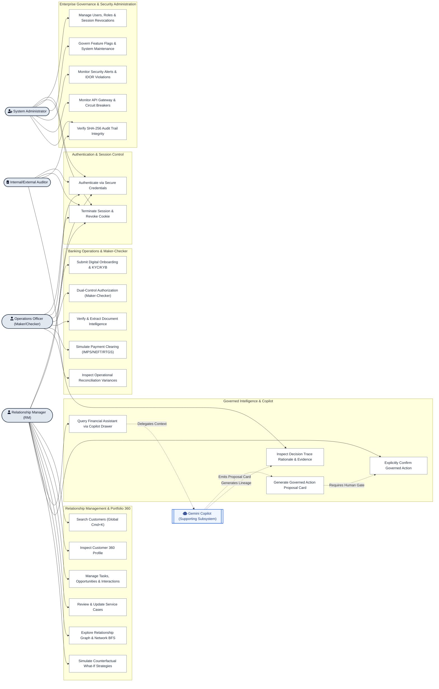
```mermaid
flowchart LR
    %% Actors
    RM(["fa:fa-user Relationship Manager (RM)"])
    OPS(["fa:fa-user-tie Operations Officer (Maker/Checker)"])
    ADMIN(["fa:fa-user-shield System Administrator"])
    AUDITOR(["fa:fa-clipboard-check Internal/External Auditor"])
    COPILOT[["fa:fa-robot Gemini Copilot (Supporting Subsystem)"]]

    %% Core Use Cases
    subgraph UC_AUTH ["Authentication & Session Control"]
        UC_LOGIN["Authenticate via Secure Credentials"]
        UC_LOGOUT["Terminate Session & Revoke Cookie"]
    end

    subgraph UC_CRM ["Relationship Management & Portfolio 360"]
        UC_SEARCH["Search Customers (Global Cmd+K)"]
        UC_VIEW_360["Inspect Customer 360 Profile"]
        UC_MANAGE_CRM["Manage Tasks, Opportunities & Interactions"]
        UC_RESOLVE_CASE["Review & Update Service Cases"]
        UC_REL_GRAPH["Explore Relationship Graph & Network BFS"]
        UC_STRATEGY_SIM["Simulate Counterfactual What-If Strategies"]
    end

    subgraph UC_OPERATIONS ["Banking Operations & Maker-Checker"]
        UC_ONBOARD["Submit Digital Onboarding & KYC/KYB"]
        UC_MAKER_CHECKER["Dual-Control Authorization (Maker-Checker)"]
        UC_DOC_REVIEW["Verify & Extract Document Intelligence"]
        UC_PAYMENT_TXN["Simulate Payment Clearing (IMPS/NEFT/RTGS)"]
        UC_RECONCILIATION["Inspect Operational Reconciliation Variances"]
    end

    subgraph UC_AI ["Governed Intelligence & Copilot"]
        UC_QUERY_COPILOT["Query Financial Assistant via Copilot Drawer"]
        UC_INSPECT_TRACE["Inspect Decision Trace Rationale & Evidence"]
        UC_PROPOSE_ACTION["Generate Governed Action Proposal Card"]
        UC_CONFIRM_ACTION["Explicitly Confirm Governed Action"]
    end

    subgraph UC_GOVERNANCE ["Enterprise Governance & Security Administration"]
        UC_AUDIT_EXPLORER["Verify SHA-256 Audit Trail Integrity"]
        UC_SECURITY_EVENTS["Monitor Security Alerts & IDOR Violations"]
        UC_USER_MGMT["Manage Users, Roles & Session Revocations"]
        UC_FEATURE_FLAGS["Govern Feature Flags & System Maintenance"]
        UC_INTEGRATIONS["Monitor API Gateway & Circuit Breakers"]
    end

    %% Actor Relationships
    RM --> UC_LOGIN
    RM --> UC_LOGOUT
    RM --> UC_SEARCH
    RM --> UC_VIEW_360
    RM --> UC_MANAGE_CRM
    RM --> UC_RESOLVE_CASE
    RM --> UC_REL_GRAPH
    RM --> UC_STRATEGY_SIM
    RM --> UC_QUERY_COPILOT
    RM --> UC_CONFIRM_ACTION

    OPS --> UC_LOGIN
    OPS --> UC_LOGOUT
    OPS --> UC_ONBOARD
    OPS --> UC_MAKER_CHECKER
    OPS --> UC_DOC_REVIEW
    OPS --> UC_PAYMENT_TXN
    OPS --> UC_RECONCILIATION

    ADMIN --> UC_LOGIN
    ADMIN --> UC_LOGOUT
    ADMIN --> UC_USER_MGMT
    ADMIN --> UC_FEATURE_FLAGS
    ADMIN --> UC_SECURITY_EVENTS
    ADMIN --> UC_INTEGRATIONS
    ADMIN --> UC_AUDIT_EXPLORER

    AUDITOR --> UC_LOGIN
    AUDITOR --> UC_LOGOUT
    AUDITOR --> UC_AUDIT_EXPLORER
    AUDITOR --> UC_INSPECT_TRACE

    %% Copilot System Integration
    UC_QUERY_COPILOT -.->|Delegates Context| COPILOT
    COPILOT -.->|Emits Proposal Card| UC_PROPOSE_ACTION
    UC_PROPOSE_ACTION -.->|Requires Human Gate| UC_CONFIRM_ACTION
    COPILOT -.->|Generates Lineage| UC_INSPECT_TRACE

    classDef actor fill:#e2e8f0,stroke:#334155,stroke-width:2px,color:#0f172a;
    classDef system fill:#eff6ff,stroke:#2563eb,stroke-width:2px,color:#1e3a8a;
    classDef uc fill:#ffffff,stroke:#64748b,stroke-width:1px,color:#1e293b;
    class RM,OPS,ADMIN,AUDITOR actor;
    class COPILOT system;
    class UC_LOGIN,UC_LOGOUT,UC_SEARCH,UC_VIEW_360,UC_MANAGE_CRM,UC_RESOLVE_CASE,UC_REL_GRAPH,UC_STRATEGY_SIM,UC_ONBOARD,UC_MAKER_CHECKER,UC_DOC_REVIEW,UC_PAYMENT_TXN,UC_RECONCILIATION,UC_QUERY_COPILOT,UC_INSPECT_TRACE,UC_PROPOSE_ACTION,UC_CONFIRM_ACTION,UC_AUDIT_EXPLORER,UC_SECURITY_EVENTS,UC_USER_MGMT,UC_FEATURE_FLAGS,UC_INTEGRATIONS uc;
```

---

## C. UML Component Diagram & Layered Architecture

The component diagram illustrates the ten distinct structural layers of the COREvia architecture, the unidirectional dependency flow, and internal encapsulation boundaries.

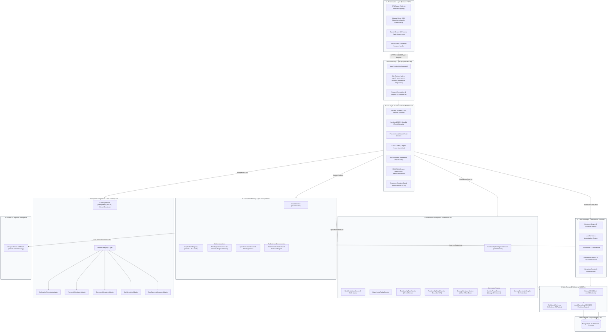
```mermaid
flowchart TD
    subgraph L1 ["1. Presentation Layer (Browser / SPA)"]
        UI_ROUTER["SPA Router (Path-to-Module Mapping)"]
        UI_VIEWS["Module Views (360, Operations, Admin, Governance)"]
        UI_COPILOT["Copilot Drawer & Proposal Card Components"]
        UI_AUTH_CTX["Auth Context & Ambient Session Handler"]
    end

    subgraph L2 ["2. API & Routing Layer (Express Router)"]
        API_ROUTER["Main Router (/api/routes.ts)"]
        SUB_ROUTERS["Sub-Routers (admin, agent, governance, journeys, operations, integrations)"]
        REQ_CORR["Request Correlation & Logging (X-Request-Id)"]
    end

    subgraph L3 ["3. Security & Trust Boundaries Middleware"]
        SEC_HEADERS["Security Headers (CSP, Nosniff, Referrer)"]
        CORS_GUARD["Hardened CORS Allowlist (Zero Wildcards)"]
        RATE_LIMITER["Process-Local Bucket Rate Limiters"]
        CSRF_GUARD["CSRF Guard (Origin / Header Validation)"]
        AUTH_MW["Authentication Middleware (requireAuth)"]
        RBAC_MW["RBAC Middleware (requireRole / requirePermission)"]
        RESOURCE_AUTH["Resource Scoping Guard (resourceAuth IDOR)"]
    end

    subgraph L4 ["4. Core Banking & CRM Domain Services"]
        SRV_CUST["CustomerService & AccountsService"]
        SRV_LOAN["LoanService & Amortization Engine"]
        SRV_CASE["CaseService & TaskService"]
        SRV_ONBOARD["OnboardingService & DocumentService"]
        SRV_INTERACTION["InteractionService & Commitments"]
    end

    subgraph L5 ["5. Relationship Intelligence & Decision Tier"]
        SRV_CORE_SCORE["RelationshipIntelligenceService (CORE Score)"]
        SRV_NBA["NextBestActionService & Rule Matrix"]
        SRV_RADAR["OpportunityRadarService"]
        SRV_TWIN["RelationshipTwinService (Event Stream)"]
        SRV_GRAPH["RelationshipGraphService (Bounded BFS)"]
        SRV_SIMULATOR["StrategySimulatorService (What-If Sandbox)"]
        SRV_TRACE["DecisionTraceService (Lineage & Evidence)"]
        SRV_JOURNEY["JourneyService (Lifecycle Orchestration)"]
    end

    subgraph L6 ["6. Controlled Banking Agent & Copilot Tier"]
        COPILOT_SRV["CopilotService (Orchestrator)"]
        COPILOT_TOOLS["Copilot Tool Registry (tools.ts - 35+ Tools)"]
        PENDING_ACTION_SRV["PendingActionService (In-Memory Proposal Cache)"]
        AGENT_EXEC["AgentExecutionService & PlanningService"]
        DETERMINISTIC_FALLBACK["Deterministic Institutional Fallback Engine"]
    end

    subgraph L7 ["7. Enterprise Integrations & API Gateway Tier"]
        API_GATEWAY["GatewayService (Idempotency, HMAC, Circuit Breakers)"]
        ADAPTER_REG["Adapter Registry Layer"]
        SIM_CORE["CoreBankingSimulatorAdapter"]
        SIM_KYC["KycSimulatorAdapter"]
        SIM_DOC["DocumentSimulatorAdapter"]
        SIM_PAY["PaymentsSimulatorAdapter"]
        SIM_NOTIF["NotificationSimulatorAdapter"]
    end

    subgraph L8 ["8. Data Access & Relational ORM Tier"]
        DRIZZLE_DB["Drizzle ORM Client (src/db/index.ts)"]
        DRIZZLE_SCHEMA["Relational Schema Definitions (58 Tables)"]
        AUDIT_REPO["AuditRepository (SHA-256 Chaining Engine)"]
    end

    subgraph L9 ["9. Persistence Tier (PostgreSQL 16)"]
        PG_DB[("PostgreSQL 16 Relational Database")]
    end

    subgraph L10 ["10. External Cognitive Intelligence"]
        GEMINI_API["Google Gemini 3.8 Flash (Server-to-Server Only)"]
    end

    %% Wiring & Dependencies
    L1 -->|HTTP POST/GET with Cookies| L2
    L2 --> L3
    L3 -->|Authorized Requests| L4
    L3 -->|Intelligence Queries| L5
    L3 -->|Copilot Queries| L6
    L3 -->|Integration Calls| L7

    L4 --> L8
    L5 --> L8
    L5 -.->|Generates Traces| SRV_TRACE
    L6 -->|Queries Context via| L4
    L6 -->|Queries Signals via| L5
    L6 -->|Uses Server Function Calls| GEMINI_API
    L6 -.->|Fallback on Disconnection| DETERMINISTIC_FALLBACK
    L6 -->|Buffers Mutations| PENDING_ACTION_SRV
    L7 --> ADAPTER_REG
    ADAPTER_REG --> SIM_CORE & SIM_KYC & SIM_DOC & SIM_PAY & SIM_NOTIF

    L8 --> PG_DB
    L8 --> AUDIT_REPO
    AUDIT_REPO --> PG_DB

    classDef layerBox fill:#f8fafc,stroke:#334155,stroke-width:1.5px;
    class L1,L2,L3,L4,L5,L6,L7,L8,L9,L10 layerBox;
```

---

## D. UML Deployment Diagram

This diagram specifies the verified current development and demonstration deployment topology, strictly contrasting it with future enterprise cloud infrastructure.

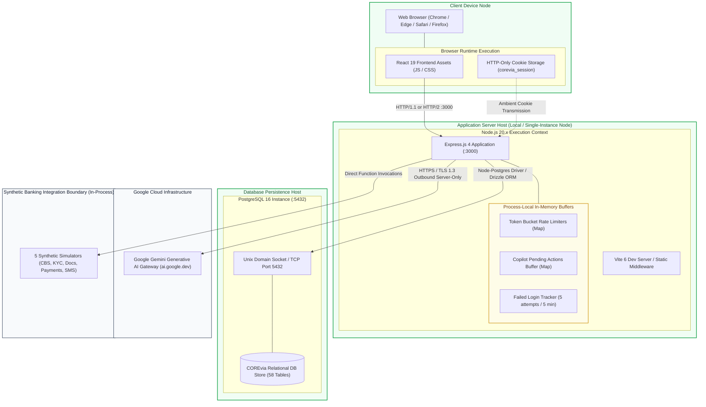
```mermaid
flowchart TB
    subgraph CLIENT_TIER ["Client Device Node"]
        BROWSER["Web Browser (Chrome / Edge / Safari / Firefox)"]
        subgraph BROWSER_RUNTIME ["Browser Runtime Execution"]
            SPA_BUNDLE["React 19 Frontend Assets (JS / CSS)"]
            CLIENT_COOKIE["HTTP-Only Cookie Storage (corevia_session)"]
        end
        BROWSER --- BROWSER_RUNTIME
    end

    subgraph HOST_NODE ["Application Server Host (Local / Single-Instance Node)"]
        subgraph APP_CONTAINER ["Node.js 20.x Execution Context"]
            VITE_DEV["Vite 6 Dev Server / Static Middleware"]
            EXPRESS_APP["Express.js 4 Application (:3000)"]
            
            subgraph IN_MEMORY_BUFFERS ["Process-Local In-Memory Buffers"]
                BUCKETS["Token Bucket Rate Limiters (Map)"]
                PENDING_ACTIONS["Copilot Pending Actions Buffer (Map)"]
                LOGIN_ATTEMPTS["Failed Login Tracker (5 attempts / 5 min)"]
            end
            
            EXPRESS_APP --- IN_MEMORY_BUFFERS
        end
    end

    subgraph DB_HOST ["Database Persistence Host"]
        subgraph PG_SERVER ["PostgreSQL 16 Instance (:5432)"]
            PG_SOCKET["Unix Domain Socket / TCP Port 5432"]
            PG_STORAGE[("COREvia Relational DB Store (58 Tables)")]
            PG_SOCKET --- PG_STORAGE
        end
    end

    subgraph CLOUD_AI ["Google Cloud Infrastructure"]
        GEMINI_ENDPOINT["Google Gemini Generative AI Gateway (ai.google.dev)"]
    end

    subgraph SIMULATED_BOUNDARY ["Synthetic Banking Integration Boundary (In-Process)"]
        SIM_ADAPTERS["5 Synthetic Simulators (CBS, KYC, Docs, Payments, SMS)"]
    end

    %% Network Connections
    SPA_BUNDLE -->|HTTP/1.1 or HTTP/2 :3000| EXPRESS_APP
    CLIENT_COOKIE -.->|Ambient Cookie Transmission| EXPRESS_APP
    EXPRESS_APP -->|Node-Postgres Driver / Drizzle ORM| PG_SOCKET
    EXPRESS_APP -->|HTTPS / TLS 1.3 Outbound Server-Only| GEMINI_ENDPOINT
    EXPRESS_APP -->|Direct Function Invocations| SIM_ADAPTERS

    %% Explanatory Boundary Annotations
    classDef verified fill:#f0fdf4,stroke:#16a34a,stroke-width:2px,color:#14532d;
    classDef memory fill:#fefce8,stroke:#ca8a04,stroke-width:1.5px,color:#713f12;
    classDef external fill:#f8fafc,stroke:#475569,stroke-width:1.5px,color:#0f172a;
    class CLIENT_TIER,HOST_NODE,DB_HOST verified;
    class IN_MEMORY_BUFFERS memory;
    class CLOUD_AI,SIMULATED_BOUNDARY external;
```

> **Deployment Distinction Note**: The active deployment is a unified Node.js and PostgreSQL runtime communicating with Google Gemini over TLS. Multi-node cloud clustering (AWS ECS, Kubernetes, Cloudflare WAF, Redis distributed cache, and external webhook listener ingresses) represents planned production deployment patterns documented in `DEPLOYMENT.md`, not the running local codebase.

---

## E. UML Class & Domain Diagrams

Because the relational schema contains 58 tables, domain entities are decomposed into six focused UML class diagrams representing logical domain models.

### E.1 Identity & Access Governance Domain

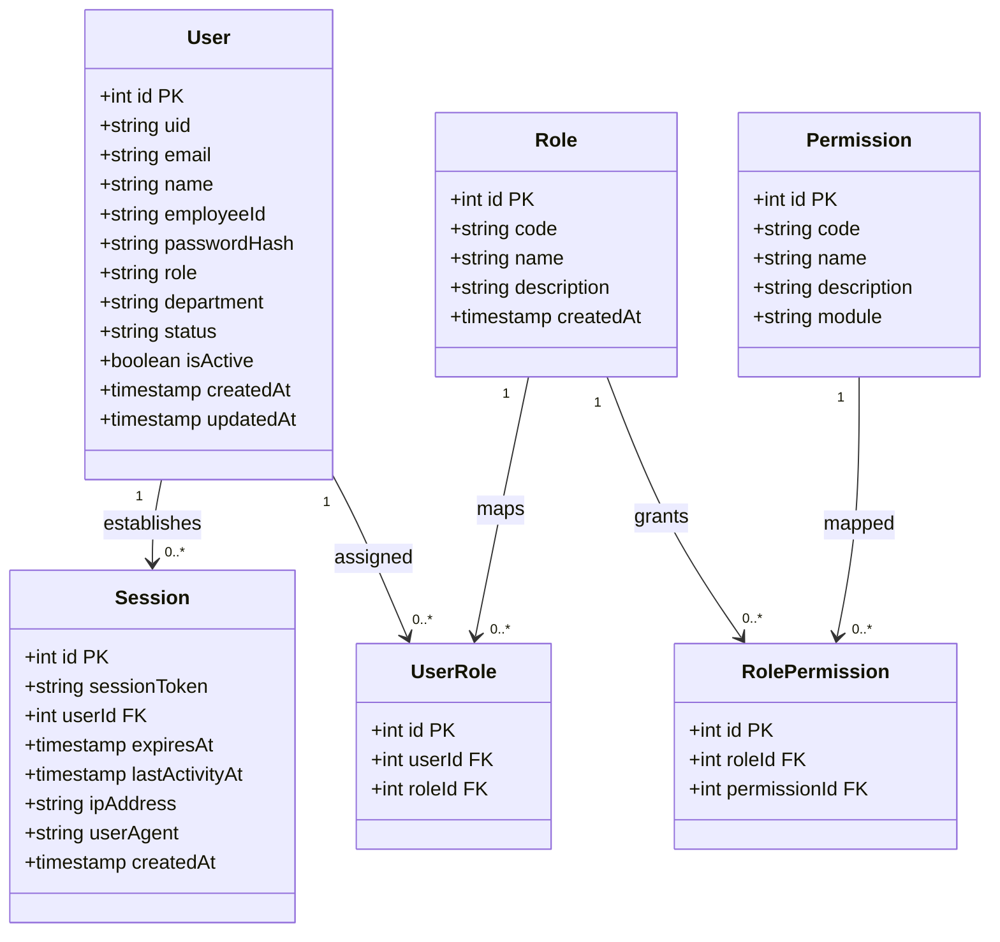
```mermaid
classDiagram
    direction TB
    class User {
        +int id PK
        +string uid
        +string email
        +string name
        +string employeeId
        +string passwordHash
        +string role
        +string department
        +string status
        +boolean isActive
        +timestamp createdAt
        +timestamp updatedAt
    }

    class Session {
        +int id PK
        +string sessionToken
        +int userId FK
        +timestamp expiresAt
        +timestamp lastActivityAt
        +string ipAddress
        +string userAgent
        +timestamp createdAt
    }

    class Role {
        +int id PK
        +string code
        +string name
        +string description
        +timestamp createdAt
    }

    class Permission {
        +int id PK
        +string code
        +string name
        +string description
        +string module
    }

    class UserRole {
        +int id PK
        +int userId FK
        +int roleId FK
    }

    class RolePermission {
        +int id PK
        +int roleId FK
        +int permissionId FK
    }

    User "1" --> "0..*" Session : establishes
    User "1" --> "0..*" UserRole : assigned
    Role "1" --> "0..*" UserRole : maps
    Role "1" --> "0..*" RolePermission : grants
    Permission "1" --> "0..*" RolePermission : mapped
```

### E.2 Core Banking & CRM Domain

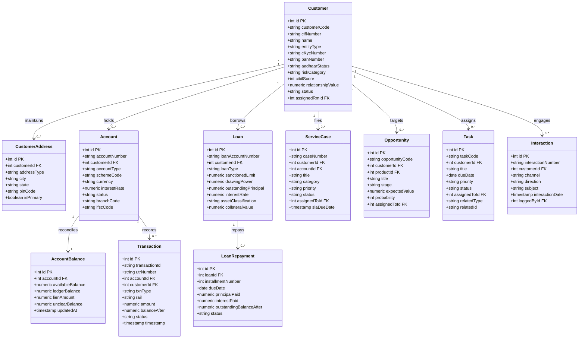
```mermaid
classDiagram
    direction TB
    class Customer {
        +int id PK
        +string customerCode
        +string cifNumber
        +string name
        +string entityType
        +string cKycNumber
        +string panNumber
        +string aadhaarStatus
        +string riskCategory
        +int cibilScore
        +numeric relationshipValue
        +string status
        +int assignedRmId FK
    }

    class CustomerAddress {
        +int id PK
        +int customerId FK
        +string addressType
        +string city
        +string state
        +string pinCode
        +boolean isPrimary
    }

    class Account {
        +int id PK
        +string accountNumber
        +int customerId FK
        +string accountType
        +string schemeCode
        +string currency
        +numeric interestRate
        +string status
        +string branchCode
        +string ifscCode
    }

    class AccountBalance {
        +int id PK
        +int accountId FK
        +numeric availableBalance
        +numeric ledgerBalance
        +numeric lienAmount
        +numeric unclearBalance
        +timestamp updatedAt
    }

    class Transaction {
        +int id PK
        +string transactionId
        +string utrNumber
        +int accountId FK
        +int customerId FK
        +string txnType
        +string rail
        +numeric amount
        +numeric balanceAfter
        +string status
        +timestamp timestamp
    }

    class Loan {
        +int id PK
        +string loanAccountNumber
        +int customerId FK
        +string loanType
        +numeric sanctionedLimit
        +numeric drawingPower
        +numeric outstandingPrincipal
        +numeric interestRate
        +string assetClassification
        +numeric collateralValue
    }

    class LoanRepayment {
        +int id PK
        +int loanId FK
        +int installmentNumber
        +date dueDate
        +numeric principalPaid
        +numeric interestPaid
        +numeric outstandingBalanceAfter
        +string status
    }

    class ServiceCase {
        +int id PK
        +string caseNumber
        +int customerId FK
        +int accountId FK
        +string title
        +string category
        +string priority
        +string status
        +int assignedToId FK
        +timestamp slaDueDate
    }

    class Opportunity {
        +int id PK
        +string opportunityCode
        +int customerId FK
        +int productId FK
        +string title
        +string stage
        +numeric expectedValue
        +int probability
        +int assignedToId FK
    }

    class Task {
        +int id PK
        +string taskCode
        +int customerId FK
        +string title
        +date dueDate
        +string priority
        +string status
        +int assignedToId FK
        +string relatedType
        +string relatedId
    }

    class Interaction {
        +int id PK
        +string interactionNumber
        +int customerId FK
        +string channel
        +string direction
        +string subject
        +timestamp interactionDate
        +int loggedById FK
    }

    Customer "1" --> "0..*" CustomerAddress : maintains
    Customer "1" --> "0..*" Account : holds
    Account "1" --> "1" AccountBalance : reconciles
    Account "1" --> "0..*" Transaction : records
    Customer "1" --> "0..*" Loan : borrows
    Loan "1" --> "0..*" LoanRepayment : repays
    Customer "1" --> "0..*" ServiceCase : files
    Customer "1" --> "0..*" Opportunity : targets
    Customer "1" --> "0..*" Task : assigns
    Customer "1" --> "0..*" Interaction : engages
```

### E.3 Digital Onboarding & Document Intelligence Domain

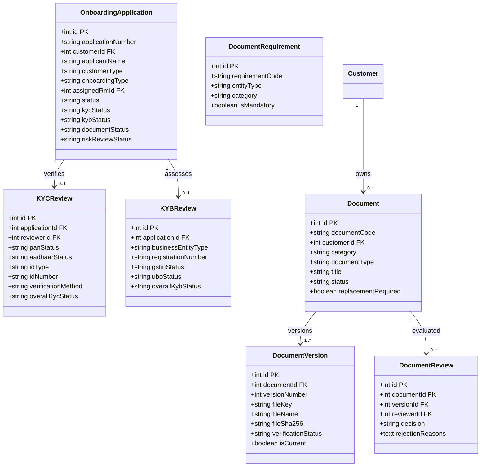
```mermaid
classDiagram
    direction TB
    class OnboardingApplication {
        +int id PK
        +string applicationNumber
        +int customerId FK
        +string applicantName
        +string customerType
        +string onboardingType
        +int assignedRmId FK
        +string status
        +string kycStatus
        +string kybStatus
        +string documentStatus
        +string riskReviewStatus
    }

    class KYCReview {
        +int id PK
        +int applicationId FK
        +int reviewerId FK
        +string panStatus
        +string aadhaarStatus
        +string idType
        +string idNumber
        +string verificationMethod
        +string overallKycStatus
    }

    class KYBReview {
        +int id PK
        +int applicationId FK
        +string businessEntityType
        +string registrationNumber
        +string gstinStatus
        +string uboStatus
        +string overallKybStatus
    }

    class Document {
        +int id PK
        +string documentCode
        +int customerId FK
        +string category
        +string documentType
        +string title
        +string status
        +boolean replacementRequired
    }

    class DocumentVersion {
        +int id PK
        +int documentId FK
        +int versionNumber
        +string fileKey
        +string fileName
        +string fileSha256
        +string verificationStatus
        +boolean isCurrent
    }

    class DocumentRequirement {
        +int id PK
        +string requirementCode
        +string entityType
        +string category
        +boolean isMandatory
    }

    class DocumentReview {
        +int id PK
        +int documentId FK
        +int versionId FK
        +int reviewerId FK
        +string decision
        +text rejectionReasons
    }

    OnboardingApplication "1" --> "0..1" KYCReview : verifies
    OnboardingApplication "1" --> "0..1" KYBReview : assesses
    Customer "1" --> "0..*" Document : owns
    Document "1" --> "1..*" DocumentVersion : versions
    Document "1" --> "0..*" DocumentReview : evaluated
```

### E.4 Relationship Intelligence & Network Topology Domain

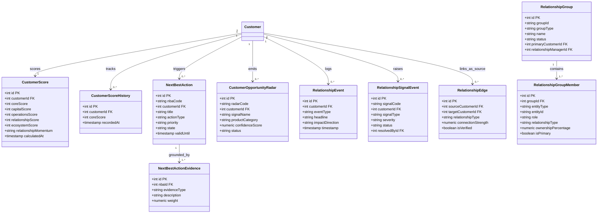
```mermaid
classDiagram
    direction TB
    class CustomerScore {
        +int id PK
        +int customerId FK
        +int coreScore
        +int capitalScore
        +int operationsScore
        +int relationshipScore
        +int ecosystemScore
        +string relationshipMomentum
        +timestamp calculatedAt
    }

    class CustomerScoreHistory {
        +int id PK
        +int customerId FK
        +int coreScore
        +timestamp recordedAt
    }

    class NextBestAction {
        +int id PK
        +string nbaCode
        +int customerId FK
        +string title
        +string actionType
        +string priority
        +string state
        +timestamp validUntil
    }

    class NextBestActionEvidence {
        +int id PK
        +int nbaId FK
        +string evidenceType
        +string description
        +numeric weight
    }

    class CustomerOpportunityRadar {
        +int id PK
        +string radarCode
        +int customerId FK
        +string signalName
        +string productCategory
        +numeric confidenceScore
        +string status
    }

    class RelationshipEvent {
        +int id PK
        +int customerId FK
        +string eventType
        +string headline
        +string impactDirection
        +timestamp timestamp
    }

    class RelationshipSignalEvent {
        +int id PK
        +string signalCode
        +int customerId FK
        +string signalType
        +string severity
        +string status
        +int resolvedById FK
    }

    class RelationshipEdge {
        +int id PK
        +int sourceCustomerId FK
        +int targetCustomerId FK
        +string relationshipType
        +numeric connectionStrength
        +boolean isVerified
    }

    class RelationshipGroup {
        +int id PK
        +string groupId
        +string groupType
        +string name
        +string status
        +int primaryCustomerId FK
        +int relationshipManagerId FK
    }

    class RelationshipGroupMember {
        +int id PK
        +int groupId FK
        +string entityType
        +string entityId
        +string role
        +string relationshipType
        +numeric ownershipPercentage
        +boolean isPrimary
    }

    Customer "1" --> "1" CustomerScore : scores
    Customer "1" --> "0..*" CustomerScoreHistory : tracks
    Customer "1" --> "0..*" NextBestAction : triggers
    NextBestAction "1" --> "1..*" NextBestActionEvidence : grounded_by
    Customer "1" --> "0..*" CustomerOpportunityRadar : emits
    Customer "1" --> "0..*" RelationshipEvent : logs
    Customer "1" --> "0..*" RelationshipSignalEvent : raises
    Customer "1" --> "0..*" RelationshipEdge : links_as_source
    RelationshipGroup "1" --> "1..*" RelationshipGroupMember : contains
```

### E.5 Decision Trace, Strategy Simulation & Action Governance Domain

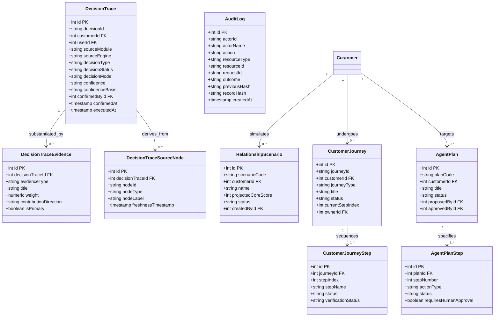
```mermaid
classDiagram
    direction TB
    class DecisionTrace {
        +int id PK
        +string decisionId
        +int customerId FK
        +int userId FK
        +string sourceModule
        +string sourceEngine
        +string decisionType
        +string decisionStatus
        +string decisionMode
        +string confidence
        +string confidenceBasis
        +int confirmedById FK
        +timestamp confirmedAt
        +timestamp executedAt
    }

    class DecisionTraceEvidence {
        +int id PK
        +int decisionTraceId FK
        +string evidenceType
        +string title
        +numeric weight
        +string contributionDirection
        +boolean isPrimary
    }

    class DecisionTraceSourceNode {
        +int id PK
        +int decisionTraceId FK
        +string nodeId
        +string nodeType
        +string nodeLabel
        +timestamp freshnessTimestamp
    }

    class RelationshipScenario {
        +int id PK
        +string scenarioCode
        +int customerId FK
        +string name
        +int projectedCoreScore
        +string status
        +int createdById FK
    }

    class CustomerJourney {
        +int id PK
        +string journeyId
        +int customerId FK
        +string journeyType
        +string title
        +string status
        +int currentStepIndex
        +int ownerId FK
    }

    class CustomerJourneyStep {
        +int id PK
        +int journeyId FK
        +int stepIndex
        +string stepName
        +string status
        +string verificationStatus
    }

    class AgentPlan {
        +int id PK
        +string planCode
        +int customerId FK
        +string title
        +string status
        +int proposedById FK
        +int approvedById FK
    }

    class AgentPlanStep {
        +int id PK
        +int planId FK
        +int stepNumber
        +string actionType
        +string status
        +boolean requiresHumanApproval
    }

    class AuditLog {
        +int id PK
        +string actorId
        +string actorName
        +string action
        +string resourceType
        +string resourceId
        +string requestId
        +string outcome
        +string previousHash
        +string recordHash
        +timestamp createdAt
    }

    DecisionTrace "1" --> "0..*" DecisionTraceEvidence : substantiated_by
    DecisionTrace "1" --> "0..*" DecisionTraceSourceNode : derives_from
    Customer "1" --> "0..*" RelationshipScenario : simulates
    Customer "1" --> "0..*" CustomerJourney : undergoes
    CustomerJourney "1" --> "1..*" CustomerJourneyStep : sequences
    Customer "1" --> "0..*" AgentPlan : targets
    AgentPlan "1" --> "1..*" AgentPlanStep : specifies
```

### E.6 Operations, API Gateway & Enterprise Integrations Domain

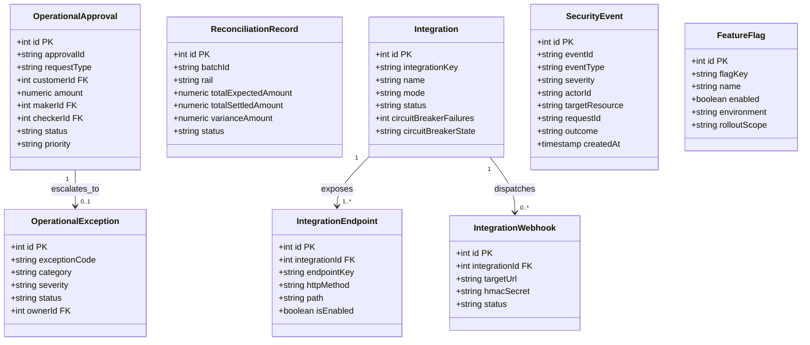
```mermaid
classDiagram
    direction TB
    class OperationalApproval {
        +int id PK
        +string approvalId
        +string requestType
        +int customerId FK
        +numeric amount
        +int makerId FK
        +int checkerId FK
        +string status
        +string priority
    }

    class OperationalException {
        +int id PK
        +string exceptionCode
        +string category
        +string severity
        +string status
        +int ownerId FK
    }

    class ReconciliationRecord {
        +int id PK
        +string batchId
        +string rail
        +numeric totalExpectedAmount
        +numeric totalSettledAmount
        +numeric varianceAmount
        +string status
    }

    class Integration {
        +int id PK
        +string integrationKey
        +string name
        +string mode
        +string status
        +int circuitBreakerFailures
        +string circuitBreakerState
    }

    class IntegrationEndpoint {
        +int id PK
        +int integrationId FK
        +string endpointKey
        +string httpMethod
        +string path
        +boolean isEnabled
    }

    class IntegrationWebhook {
        +int id PK
        +int integrationId FK
        +string targetUrl
        +string hmacSecret
        +string status
    }

    class SecurityEvent {
        +int id PK
        +string eventId
        +string eventType
        +string severity
        +string actorId
        +string targetResource
        +string requestId
        +string outcome
        +timestamp createdAt
    }

    class FeatureFlag {
        +int id PK
        +string flagKey
        +string name
        +boolean enabled
        +string environment
        +string rolloutScope
    }

    OperationalApproval "1" --> "0..1" OperationalException : escalates_to
    Integration "1" --> "1..*" IntegrationEndpoint : exposes
    Integration "1" --> "0..*" IntegrationWebhook : dispatches
```

---

## F. UML Sequence Diagram — Enterprise Authentication

This sequence diagram depicts the verified authentication lifecycle: credential validation, HTTP-only cookie setting, protected resource authorization with role enforcement, and session revocation.

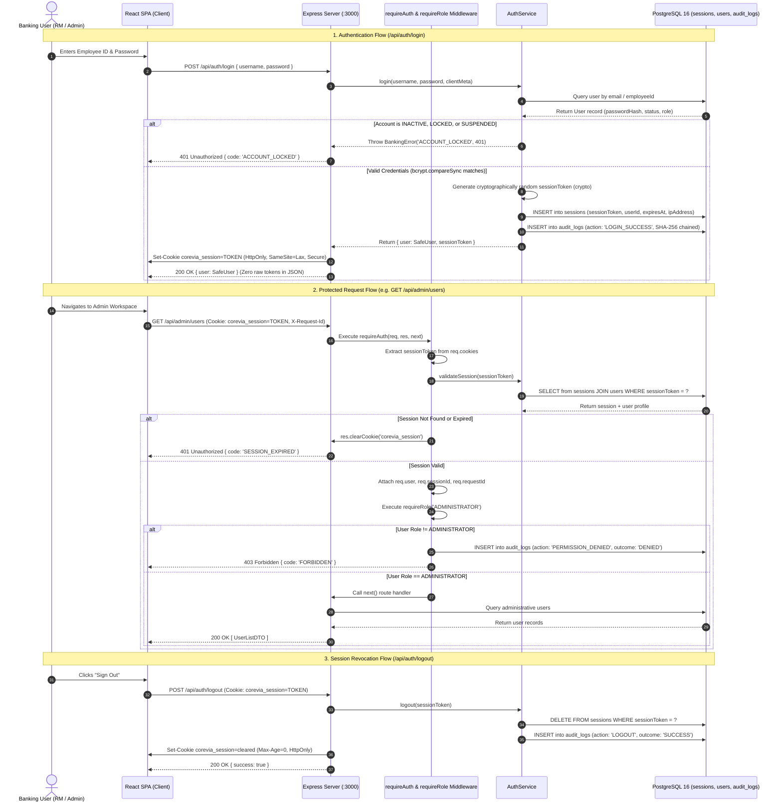
```mermaid
sequenceDiagram
    autonumber
    actor User as Banking User (RM / Admin)
    participant Browser as React SPA (Client)
    participant Server as Express Server (:3000)
    participant AuthMW as requireAuth & requireRole Middleware
    participant AuthService as AuthService
    participant DB as PostgreSQL 16 (sessions, users, audit_logs)

    %% 1. LOGIN FLOW
    Note over User, DB: 1. Authentication Flow (/api/auth/login)
    User->>Browser: Enters Employee ID & Password
    Browser->>Server: POST /api/auth/login { username, password }
    Server->>AuthService: login(username, password, clientMeta)
    AuthService->>DB: Query user by email / employeeId
    DB-->>AuthService: Return User record (passwordHash, status, role)
    
    alt Account is INACTIVE, LOCKED, or SUSPENDED
        AuthService-->>Server: Throw BankingError('ACCOUNT_LOCKED', 401)
        Server-->>Browser: 401 Unauthorized { code: 'ACCOUNT_LOCKED' }
    else Valid Credentials (bcrypt.compareSync matches)
        AuthService->>AuthService: Generate cryptographically random sessionToken (crypto)
        AuthService->>DB: INSERT into sessions (sessionToken, userId, expiresAt, ipAddress)
        AuthService->>DB: INSERT into audit_logs (action: 'LOGIN_SUCCESS', SHA-256 chained)
        AuthService-->>Server: Return { user: SafeUser, sessionToken }
        Server->>Browser: Set-Cookie corevia_session=TOKEN (HttpOnly, SameSite=Lax, Secure)
        Server-->>Browser: 200 OK { user: SafeUser } (Zero raw tokens in JSON)
    end

    %% 2. PROTECTED REQUEST FLOW
    Note over User, DB: 2. Protected Request Flow (e.g. GET /api/admin/users)
    User->>Browser: Navigates to Admin Workspace
    Browser->>Server: GET /api/admin/users (Cookie: corevia_session=TOKEN, X-Request-Id)
    Server->>AuthMW: Execute requireAuth(req, res, next)
    AuthMW->>AuthMW: Extract sessionToken from req.cookies
    AuthMW->>AuthService: validateSession(sessionToken)
    AuthService->>DB: SELECT from sessions JOIN users WHERE sessionToken = ?
    DB-->>AuthService: Return session + user profile
    
    alt Session Not Found or Expired
        AuthMW->>Server: res.clearCookie('corevia_session')
        Server-->>Browser: 401 Unauthorized { code: 'SESSION_EXPIRED' }
    else Session Valid
        AuthMW->>AuthMW: Attach req.user, req.sessionId, req.requestId
        AuthMW->>AuthMW: Execute requireRole('ADMINISTRATOR')
        alt User Role != ADMINISTRATOR
            AuthMW->>DB: INSERT into audit_logs (action: 'PERMISSION_DENIED', outcome: 'DENIED')
            AuthMW-->>Browser: 403 Forbidden { code: 'FORBIDDEN' }
        else User Role == ADMINISTRATOR
            AuthMW->>Server: Call next() route handler
            Server->>DB: Query administrative users
            DB-->>Server: Return user records
            Server-->>Browser: 200 OK [ UserListDTO ]
        end
    end

    %% 3. LOGOUT FLOW
    Note over User, DB: 3. Session Revocation Flow (/api/auth/logout)
    User->>Browser: Clicks "Sign Out"
    Browser->>Server: POST /api/auth/logout (Cookie: corevia_session=TOKEN)
    Server->>AuthService: logout(sessionToken)
    AuthService->>DB: DELETE FROM sessions WHERE sessionToken = ?
    AuthService->>DB: INSERT into audit_logs (action: 'LOGOUT', outcome: 'SUCCESS')
    Server->>Browser: Set-Cookie corevia_session=cleared (Max-Age=0, HttpOnly)
    Server-->>Browser: 200 OK { success: true }
```

---

## G. UML Sequence Diagram — Controlled Banking Copilot Flow

This sequence models the exact controlled AI flow implemented in `CopilotService`, `tools.ts`, and `PendingActionService`. Crucially, it illustrates how Gemini executes server-side functions but is **strictly prevented from unilateral mutations**.

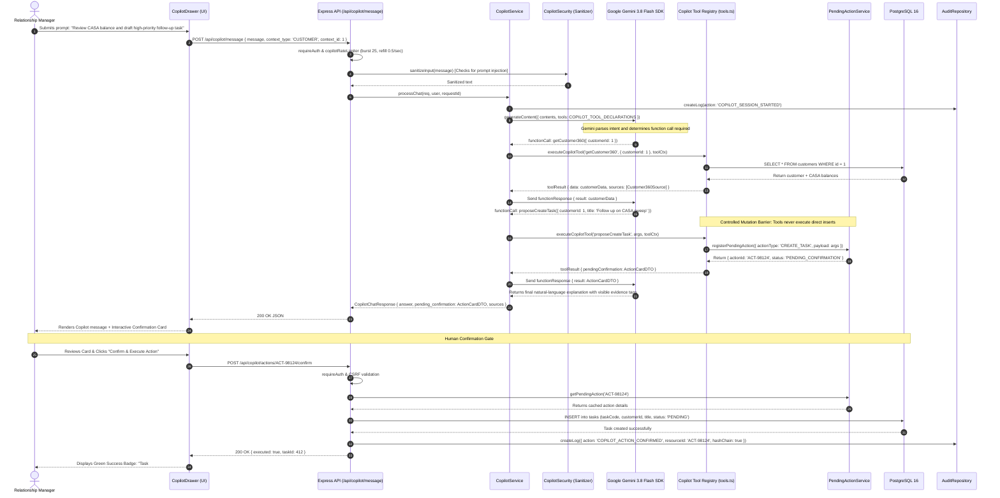
```mermaid
sequenceDiagram
    autonumber
    actor RM as Relationship Manager
    participant Drawer as CopilotDrawer (UI)
    participant API as Express API (/api/copilot/message)
    participant CopilotSrv as CopilotService
    participant Security as CopilotSecurity (Sanitizer)
    participant Gemini as Google Gemini 3.8 Flash SDK
    participant ToolHandler as Copilot Tool Registry (tools.ts)
    participant PendingSrv as PendingActionService
    participant DB as PostgreSQL 16
    participant Audit as AuditRepository

    RM->>Drawer: Submits prompt: "Review CASA balance and draft high-priority follow-up task"
    Drawer->>API: POST /api/copilot/message { message, context_type: 'CUSTOMER', context_id: 1 }
    API->>API: requireAuth & copilotRateLimiter (burst 25, refill 0.5/sec)
    API->>Security: sanitizeInput(message) [Checks for prompt injection]
    Security-->>API: Sanitized text
    API->>CopilotSrv: processChat(req, user, requestId)
    CopilotSrv->>Audit: createLog(action: 'COPILOT_SESSION_STARTED')

    %% Tool Calling Loop
    CopilotSrv->>Gemini: generateContent({ contents, tools: COPILOT_TOOL_DECLARATIONS })
    Note over Gemini: Gemini parses intent and determines function call required
    Gemini-->>CopilotSrv: functionCall: getCustomer360({ customerId: 1 })
    
    CopilotSrv->>ToolHandler: executeCopilotTool('getCustomer360', { customerId: 1 }, toolCtx)
    ToolHandler->>DB: SELECT * FROM customers WHERE id = 1
    DB-->>ToolHandler: Return customer + CASA balances
    ToolHandler-->>CopilotSrv: toolResult { data: customerData, sources: [Customer360Source] }

    CopilotSrv->>Gemini: Send functionResponse { result: customerData }
    Gemini-->>CopilotSrv: functionCall: proposeCreateTask({ customerId: 1, title: 'Follow up on CASA sweep' })
    
    Note over ToolHandler, PendingSrv: Controlled Mutation Barrier: Tools never execute direct inserts
    CopilotSrv->>ToolHandler: executeCopilotTool('proposeCreateTask', args, toolCtx)
    ToolHandler->>PendingSrv: registerPendingAction({ actionType: 'CREATE_TASK', payload: args })
    PendingSrv-->>ToolHandler: Return { actionId: 'ACT-98124', status: 'PENDING_CONFIRMATION' }
    ToolHandler-->>CopilotSrv: toolResult { pendingConfirmation: ActionCardDTO }

    CopilotSrv->>Gemini: Send functionResponse { result: ActionCardDTO }
    Gemini-->>CopilotSrv: Returns final natural-language explanation with visible evidence tags
    CopilotSrv-->>API: CopilotChatResponse { answer, pending_confirmation: ActionCardDTO, sources }
    API-->>Drawer: 200 OK JSON
    Drawer-->>RM: Renders Copilot message + Interactive Confirmation Card

    %% Human-in-the-Loop Confirmation
    Note over RM, DB: Human Confirmation Gate
    RM->>Drawer: Reviews Card & Clicks "Confirm & Execute Action"
    Drawer->>API: POST /api/copilot/actions/ACT-98124/confirm
    API->>API: requireAuth & CSRF validation
    API->>PendingSrv: getPendingAction('ACT-98124')
    PendingSrv-->>API: Returns cached action details
    API->>DB: INSERT into tasks (taskCode, customerId, title, status: 'PENDING')
    DB-->>API: Task created successfully
    API->>Audit: createLog({ action: 'COPILOT_ACTION_CONFIRMED', resourceId: 'ACT-98124', hashChain: true })
    API-->>Drawer: 200 OK { executed: true, taskId: 412 }
    Drawer-->>RM: Displays Green Success Badge: "Task #412 Created"
```

---

## H. UML Activity Diagram — Signal-to-Action Governance Lifecycle

The activity diagram models how market, behavioral, and transactional events evolve into actionable banking interventions across the intelligence and governance pipelines.

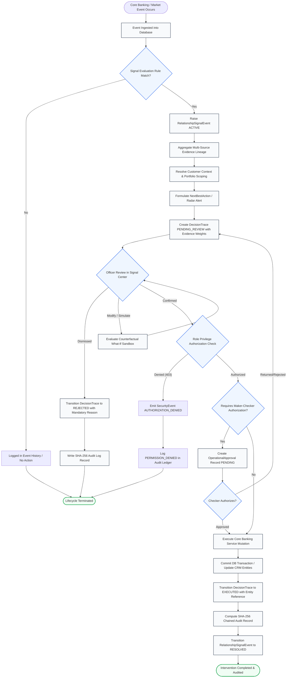
```mermaid
flowchart TD
    START([Core Banking / Market Event Occurs]) --> EVT_INGEST[Event Ingested into Database]
    EVT_INGEST --> DETECT_SIG{Signal Evaluation Rule Match?}

    DETECT_SIG -- No --> IGNORE[Logged in Event History / No Action]
    IGNORE --> TERMINAL_END([Lifecycle Terminated])

    DETECT_SIG -- Yes --> RAISE_SIG[Raise RelationshipSignalEvent ACTIVE]
    RAISE_SIG --> AGGREGATE[Aggregate Multi-Source Evidence Lineage]
    AGGREGATE --> CONTEXT_RESOLVE[Resolve Customer Context & Portfolio Scoping]
    CONTEXT_RESOLVE --> FORMULATE[Formulate NextBestAction / Radar Alert]
    
    FORMULATE --> CREATE_TRACE[Create DecisionTrace PENDING_REVIEW with Evidence Weights]
    CREATE_TRACE --> HUMAN_REVIEW{Officer Review in Signal Center}

    HUMAN_REVIEW -- Dismissed --> REJECT_ACT[Transition DecisionTrace to REJECTED with Mandatory Reason]
    REJECT_ACT --> AUDIT_REJECT[Write SHA-256 Audit Log Record]
    AUDIT_REJECT --> TERMINAL_END

    HUMAN_REVIEW -- Modify / Simulate --> RUN_SIM[Evaluate Counterfactual What-If Sandbox]
    RUN_SIM --> HUMAN_REVIEW

    HUMAN_REVIEW -- Confirmed --> CHECK_AUTH{Role Privilege Authorization Check}
    
    CHECK_AUTH -- Denied (403) --> SEC_ALERT[Emit SecurityEvent AUTHORIZATION_DENIED]
    SEC_ALERT --> AUDIT_DENY[Log PERMISSION_DENIED in Audit Ledger]
    AUDIT_DENY --> TERMINAL_END

    CHECK_AUTH -- Authorized --> DUAL_CTRL{Requires Maker-Checker Authorization?}

    DUAL_CTRL -- Yes --> CREATE_APR[Create OperationalApproval Record PENDING]
    CREATE_APR --> CHECKER_REVIEW{Checker Authorizes?}
    CHECKER_REVIEW -- Returned/Rejected --> CREATE_TRACE
    CHECKER_REVIEW -- Approved --> EXECUTE_MUTATION[Execute Core Banking Service Mutation]

    DUAL_CTRL -- No --> EXECUTE_MUTATION

    EXECUTE_MUTATION --> ATOMIC_WRITE[Commit DB Transaction / Update CRM Entities]
    ATOMIC_WRITE --> UPDATE_TRACE[Transition DecisionTrace to EXECUTED with Entity Reference]
    UPDATE_TRACE --> HASH_AUDIT[Compute SHA-256 Chained Audit Record]
    HASH_AUDIT --> RESOLVE_SIG[Transition RelationshipSignalEvent to RESOLVED]
    RESOLVE_SIG --> SUCCESS_END([Intervention Completed & Audited])

    classDef proc fill:#f8fafc,stroke:#334155,stroke-width:1.5px;
    classDef decision fill:#eff6ff,stroke:#2563eb,stroke-width:1.5px;
    classDef finish fill:#f0fdf4,stroke:#16a34a,stroke-width:2px;
    class EVT_INGEST,RAISE_SIG,AGGREGATE,CONTEXT_RESOLVE,FORMULATE,CREATE_TRACE,REJECT_ACT,AUDIT_REJECT,RUN_SIM,CREATE_APR,EXECUTE_MUTATION,ATOMIC_WRITE,UPDATE_TRACE,HASH_AUDIT,RESOLVE_SIG proc;
    class DETECT_SIG,HUMAN_REVIEW,CHECK_AUTH,DUAL_CTRL,CHECKER_REVIEW decision;
    class TERMINAL_END,SUCCESS_END finish;
```

---

## I. UML State Diagrams

All state machines below reflect the exact string literals and enums defined in `src/db/schema.ts` and validated by unit test suites.

### I.1 Service Case Dispute & Grievance Lifecycle

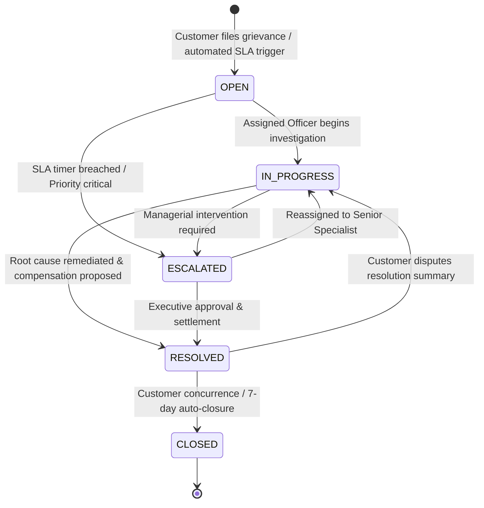
```mermaid
stateDiagram-v2
    [*] --> OPEN : Customer files grievance / automated SLA trigger
    
    OPEN --> IN_PROGRESS : Assigned Officer begins investigation
    OPEN --> ESCALATED : SLA timer breached / Priority critical
    
    IN_PROGRESS --> ESCALATED : Managerial intervention required
    IN_PROGRESS --> RESOLVED : Root cause remediated & compensation proposed
    
    ESCALATED --> IN_PROGRESS : Reassigned to Senior Specialist
    ESCALATED --> RESOLVED : Executive approval & settlement
    
    RESOLVED --> CLOSED : Customer concurrence / 7-day auto-closure
    RESOLVED --> IN_PROGRESS : Customer disputes resolution summary
    
    CLOSED --> [*]
```

### I.2 Commercial Opportunity Pipeline Lifecycle

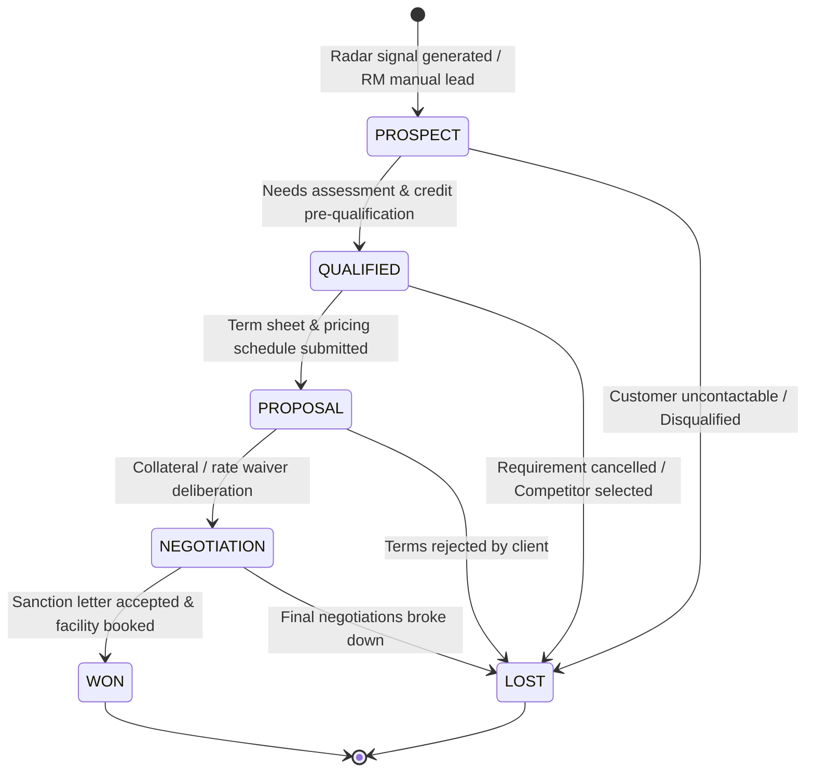
```mermaid
stateDiagram-v2
    [*] --> PROSPECT : Radar signal generated / RM manual lead
    
    PROSPECT --> QUALIFIED : Needs assessment & credit pre-qualification
    PROSPECT --> LOST : Customer uncontactable / Disqualified
    
    QUALIFIED --> PROPOSAL : Term sheet & pricing schedule submitted
    QUALIFIED --> LOST : Requirement cancelled / Competitor selected
    
    PROPOSAL --> NEGOTIATION : Collateral / rate waiver deliberation
    PROPOSAL --> LOST : Terms rejected by client
    
    NEGOTIATION --> WON : Sanction letter accepted & facility booked
    NEGOTIATION --> LOST : Final negotiations broke down
    
    WON --> [*]
    LOST --> [*]
```

### I.3 Digital Onboarding & KYC/KYB Application Lifecycle

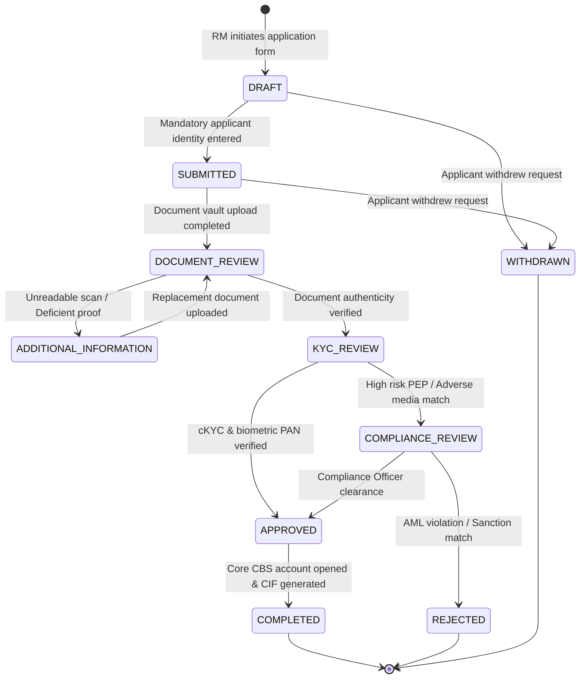
```mermaid
stateDiagram-v2
    [*] --> DRAFT : RM initiates application form
    
    DRAFT --> SUBMITTED : Mandatory applicant identity entered
    
    SUBMITTED --> DOCUMENT_REVIEW : Document vault upload completed
    
    DOCUMENT_REVIEW --> ADDITIONAL_INFORMATION : Unreadable scan / Deficient proof
    ADDITIONAL_INFORMATION --> DOCUMENT_REVIEW : Replacement document uploaded
    
    DOCUMENT_REVIEW --> KYC_REVIEW : Document authenticity verified
    
    KYC_REVIEW --> COMPLIANCE_REVIEW : High risk PEP / Adverse media match
    KYC_REVIEW --> APPROVED : cKYC & biometric PAN verified
    
    COMPLIANCE_REVIEW --> APPROVED : Compliance Officer clearance
    COMPLIANCE_REVIEW --> REJECTED : AML violation / Sanction match
    
    APPROVED --> COMPLETED : Core CBS account opened & CIF generated
    
    DRAFT --> WITHDRAWN : Applicant withdrew request
    SUBMITTED --> WITHDRAWN : Applicant withdrew request
    
    COMPLETED --> [*]
    REJECTED --> [*]
    WITHDRAWN --> [*]
```

### I.4 Operational Approval & Maker-Checker Dual-Control Lifecycle

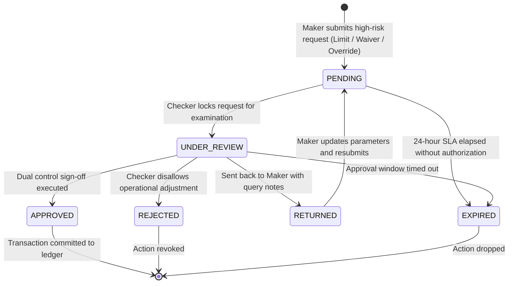
```mermaid
stateDiagram-v2
    [*] --> PENDING : Maker submits high-risk request (Limit / Waiver / Override)
    
    PENDING --> UNDER_REVIEW : Checker locks request for examination
    
    UNDER_REVIEW --> APPROVED : Dual control sign-off executed
    UNDER_REVIEW --> REJECTED : Checker disallows operational adjustment
    UNDER_REVIEW --> RETURNED : Sent back to Maker with query notes
    
    RETURNED --> PENDING : Maker updates parameters and resubmits
    
    PENDING --> EXPIRED : 24-hour SLA elapsed without authorization
    UNDER_REVIEW --> EXPIRED : Approval window timed out
    
    APPROVED --> [*] : Transaction committed to ledger
    REJECTED --> [*] : Action revoked
    EXPIRED --> [*] : Action dropped
```

### I.5 Relationship Signal Event Lifecycle

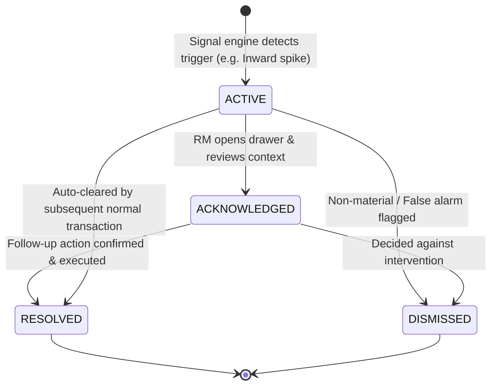
```mermaid
stateDiagram-v2
    [*] --> ACTIVE : Signal engine detects trigger (e.g. Inward spike)
    
    ACTIVE --> ACKNOWLEDGED : RM opens drawer & reviews context
    ACTIVE --> DISMISSED : Non-material / False alarm flagged
    
    ACKNOWLEDGED --> RESOLVED : Follow-up action confirmed & executed
    ACKNOWLEDGED --> DISMISSED : Decided against intervention
    
    ACTIVE --> RESOLVED : Auto-cleared by subsequent normal transaction
    
    RESOLVED --> [*]
    DISMISSED --> [*]
```

### I.6 Decision Trace & Governance Lifecycle

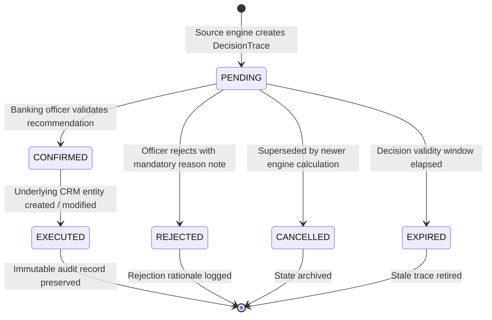
```mermaid
stateDiagram-v2
    [*] --> PENDING : Source engine creates DecisionTrace
    
    PENDING --> CONFIRMED : Banking officer validates recommendation
    PENDING --> REJECTED : Officer rejects with mandatory reason note
    PENDING --> CANCELLED : Superseded by newer engine calculation
    PENDING --> EXPIRED : Decision validity window elapsed
    
    CONFIRMED --> EXECUTED : Underlying CRM entity created / modified
    
    EXECUTED --> [*] : Immutable audit record preserved
    REJECTED --> [*] : Rejection rationale logged
    CANCELLED --> [*] : State archived
    EXPIRED --> [*] : Stale trace retired
```

---

## J. Database Architecture & Relational Topology Summary

### ORM Configuration & Model Integrity
COREvia manages its database tier through **Drizzle ORM (`drizzle-orm 0.45.2`)** with standard PostgreSQL dialect drivers (`pg 8.23.0`). 
- **Type Safety**: Table definitions in `src/db/schema.ts` export static type definitions (`$inferSelect`, `$inferInsert`) guaranteeing end-to-end compile-time contract enforcement.
- **Relational Integrity**: Foreign key constraints enforce strict referential boundaries:
  - Critical entities (e.g. `accounts` to `customers`, `loans` to `customers`) enforce `onDelete: 'restrict'`.
  - Dependent attributes (e.g. `customer_addresses`, `account_balances`, `case_comments`) enforce `onDelete: 'cascade'`.
  - Administrative linkages (e.g. `assigned_rm_id`, `checker_id`) enforce `onDelete: 'set null'`.

### Main Relational Groupings (58 Tables)

```
┌─────────────────────────────────┬────────────────────────────────────────────────────────┐
│ Domain Group                    │ Tables                                                 │
├─────────────────────────────────┼────────────────────────────────────────────────────────┤
│ 1. Identity & RBAC              │ users, sessions, roles, permissions, user_roles,       │
│                                 │ role_permissions                                       │
│ 2. Master Banking & CRM         │ customers, customer_addresses, customer_contacts,      │
│                                 │ accounts, account_balances, transactions, products,    │
│                                 │ customer_products, loans, loan_repayments,             │
│                                 │ service_cases, case_comments, tasks, opportunities,    │
│                                 │ opportunity_activities, interactions,                  │
│                                 │ interaction_participants, interaction_links,           │
│                                 │ interaction_commitments                                 │
│ 3. Onboarding & Documents       │ onboarding_applications, onboarding_products,          │
│                                 │ kyc_reviews, kyb_reviews, onboarding_documents,        │
│                                 │ onboarding_exceptions, onboarding_assignments,         │
│                                 │ onboarding_events, documents, document_versions,       │
│                                 │ document_requirements, document_reviews,               │
│                                 │ document_links, document_extractions                   │
│ 4. Relationship Intelligence    │ customer_scores, customer_score_history,               │
│                                 │ customer_insights, next_best_actions,                  │
│                                 │ next_best_action_evidence, customer_opportunity_radar, │
│                                 │ customer_opportunity_radar_evidence,                  │
│                                 │ relationship_events, relationship_state_history,       │
│                                 │ relationship_snapshots, relationship_signal_events,    │
│                                 │ relationship_action_trace, relationship_edges,         │
│                                 │ relationship_value_snapshots, relationship_groups,     │
│                                 │ relationship_group_members                             │
│ 5. Decisions & Journey Engine   │ decision_traces, decision_trace_evidence,               │
│                                 │ decision_trace_source_nodes, relationship_scenarios,   │
│                                 │ relationship_scenario_actions, agent_sessions,         │
│                                 │ agent_plans, agent_plan_steps, journey_templates,      │
│                                 │ journey_template_steps, customer_journeys,             │
│                                 │ customer_journey_steps, journey_outcomes               │
│ 6. Operations & API Gateway     │ operational_approvals, operational_exceptions,         │
│                                 │ reconciliation_records, operational_events,            │
│                                 │ governance_exceptions, integrations,                   │
│                                 │ integration_endpoints, integration_webhooks,           │
│                                 │ webhook_deliveries, integration_events,                │
│                                 │ idempotency_records, integration_credentials           │
│ 7. Security, Audit & Admin      │ audit_logs, feature_flags, security_events,            │
│                                 │ system_settings, notifications,                        │
│                                 │ user_notification_preferences                          │
└─────────────────────────────────┴────────────────────────────────────────────────────────┘
```

### Append-Only Audit Ledgers & Graph Representation
- **Cryptographic Audit Chaining**: The `audit_logs` table maintains a forward-linked SHA-256 hash chain:
  $$\text{recordHash} = \text{SHA-256}(\text{previousHash} \parallel \text{actorId} \parallel \text{action} \parallel \text{resourceType} \parallel \text{resourceId} \parallel \text{requestId} \parallel \text{outcome} \parallel \text{timestamp})$$
  The genesis record begins with a 64-character null hex string (`00000000...0000`). Tampering with any historical audit entry breaks validation across all subsequent records.
- **Explicit Network Graph Storage**: Rather than an external graph engine, graph relationships are maintained natively in PostgreSQL within the `relationship_edges` table (linking `source_customer_id`, `target_customer_id`, `relationship_type`, and `connection_strength`). Bounded Breadth-First Search (BFS) graph traversals execute with depth constraints ($\le 3$) to prevent runaway database joins.

### Migration & Seeding Lifecycle
- **Migrations**: Generated via `drizzle-kit generate` into SQL files and applied via `drizzle-kit push`.
- **Governed Seeding**: The server startup orchestrates deterministic, non-duplicative seed routines (`seedAuthUsersAndRoles`, `seedInteractions`, `seedDocuments`, `seedRelationshipTwinData`, `seedDecisionTraces`, `seedStrategyScenarios`, `seedJourneys`, `seedOperationsData`, `seedIntegrationData`, `seedAdminData`). Seeding verifies whether records exist before inserting, preventing duplicate data.

---

## K. Security Boundaries & Defense-in-Depth Model

COREvia implements eight defense-in-depth security layers to enforce institutional banking governance:

```
+-----------------------------------------------------------------------------------------------+
| Layer 1: Edge & Network Security Headers                                                      |
| • CSP: script-src 'self' 'unsafe-inline'; default-src 'self'; frame-ancestors restricted      |
| • MIME: X-Content-Type-Options: nosniff | Referrer-Policy: strict-origin-when-cross-origin    |
| • Permissions-Policy: camera=(), microphone=(), geolocation=(), payment=()                    |
+-----------------------------------------------------------------------------------------------+
| Layer 2: Hardened CORS & Origin Allowlist                                                     |
| • Zero wildcards (*), zero dynamic reflection of Host / X-Forwarded-Host                      |
| • Evaluated strictly against CORS_ALLOWED_ORIGINS and APP_URL via new URL().origin            |
+-----------------------------------------------------------------------------------------------+
| Layer 3: CSRF Defense Model                                                                   |
| • All state-mutating HTTP methods (POST, PUT, PATCH, DELETE) require either:                  |
|   (a) Exact match against trusted allowed origins (Origin or Referer header), OR              |
|   (b) Verified x-csrf-token header. Disallowed cross-origin requests trigger 403 Forbidden.   |
+-----------------------------------------------------------------------------------------------+
| Layer 4: Ambient Cookie Authentication & Credential Isolation                                 |
| • Server sets HttpOnly, Secure, SameSite=Lax/None cookie (corevia_session)                     |
| • JSON responses strictly withhold password hashes, session tokens, and Bearer secrets         |
| • Atomic Session Purge: Changing status to INACTIVE/LOCKED/SUSPENDED purges all active sessions|
| • Anti-Lockout Invariant: Administrators cannot deactivate their own user account              |
+-----------------------------------------------------------------------------------------------+
| Layer 5: Role-Based Access Control (RBAC) & 15 Permission Domains                             |
| • Roles: ADMINISTRATOR, COMPLIANCE_OFFICER, BRANCH_OPS_HEAD, RELATIONSHIP_MANAGER, AUDITOR,   |
|   TELLER (Tellers are blocked with 403 Forbidden on governance and administrative endpoints)  |
| • 15 Standard Domains: CUSTOMERS, ACCOUNTS, LOANS, PRODUCTS, SERVICE, OPPORTUNITIES, TASKS,   |
|   ANALYTICS, COPILOT, OPERATIONS, INTEGRATIONS, DOCUMENTS, ONBOARDING, GOVERNANCE, ADMIN      |
+-----------------------------------------------------------------------------------------------+
| Layer 6: Insecure Direct Object Reference (IDOR) & Portfolio Scoping                          |
| • resourceAuth.authorizeCustomer strictly validates user-to-customer portfolio assignments   |
| • Cross-customer trace and scenario comparisons rejected (400 Bad Request)                   |
| • Group 360 Privacy Masking: Unauthorized members displayed as "Protected Member", with      |
|   balances, CIF, PAN, and scores suppressed                                                   |
+-----------------------------------------------------------------------------------------------+
| Layer 7: Controlled AI Guardrails & Prompt Injection Defense                                  |
| • Zero client-side API keys; all Gemini requests executed server-side via Node.js             |
| • Prompt injection defense: All retrieved CRM database strings treated as untrusted text      |
| • Zero Unilateral Mutations: AI tools can only emit proposal cards for explicit human signoff|
+-----------------------------------------------------------------------------------------------+
| Layer 8: Tamper-Evident Auditability & Neutral Monitoring                                     |
| • SHA-256 cryptographic hash chaining across every operational event and administrative change|
| • Neutral monitoring: Access denials logged without accusatory language or arbitrary scores   |
+-----------------------------------------------------------------------------------------------+
```

---

## L. Integration Architecture & Adapter Classification

Phase 38 established the **Internal API Gateway** and adapter registry. COREvia classifies all system integrations into three strict categories to prevent false claims of live banking connectivity:

```
┌─────────────────────────────────┬───────────────────┬───────────────────────────────────────────┐
│ Integration Category            │ Operational State │ Implemented Modules                       │
├─────────────────────────────────┼───────────────────┼───────────────────────────────────────────┤
│ 1. Synthetic Simulators         │ `SIMULATOR`       │ • Core Banking Engine (INT-COREBANKING)   │
│    (In-process deterministic    │ Status:           │ • KYC & National Identity (INT-KYC)       │
│    banking logic with           │ `SIMULATED`       │ • Document Vault (INT-DOCMGMT)            │
│    synthetic data watermark)    │ (Never CONNECTED) │ • Payments Clearing Switch (INT-PAYMENTS) │
│                                 │                   │ • Notification Gateway (INT-NOTIFICATION) │
├─────────────────────────────────┼───────────────────┼───────────────────────────────────────────┤
│ 2. Internal Software Adapters   │ `ADAPTER`         │ • Database Event Listeners                │
│    (Native services bridging    │ Status:           │ • Decision Trace Lineage Aggregator       │
│    internal modules)            │ `AVAILABLE`       │ • Journey Step Compliance Verifier        │
├─────────────────────────────────┼───────────────────┼───────────────────────────────────────────┤
│ 3. External Cloud Rails         │ `EXTERNAL`        │ • Google Gemini 3.8 Flash (Server-Side)   │
│    (External network endpoints; │ Status:           │   Status: CONNECTED (when key configured) │
│    requires production contract │ `NOT_CONFIGURED`  │ • Live NPCI/RBI Payment Switch (Planned)  │
│    and physical credentials)    │ or `CONFIGURED`   │ • Live UIDAI/cKYC Central Registry (Plan) │
└─────────────────────────────────┴───────────────────┴───────────────────────────────────────────┘
```

### Internal API Gateway Capabilities
- **Idempotency Gate**: Outbound integration calls accept an `Idempotency-Key` header. The gateway hashes `(key + endpoint + integrationId + requestBody)` using SHA-256. Replayed requests with matching payloads return cached responses; payload mismatches are rejected with `422 Unprocessable Entity` (`DUPLICATE_REQUEST_MISMATCH`).
- **Circuit Breaker Engine**: Tracks consecutive request failures per adapter. After 5 consecutive failures, the breaker enters `OPEN` state, immediately rejecting requests for a 30-second cooldown period before entering `HALF_OPEN`.
- **HMAC Webhook Signing**: Dispatched webhooks include `X-Signature-SHA256` computed over the JSON payload using the integration's pre-shared HMAC secret key.

---

## M. Design Assumptions, System Invariants & Operational Limitations

1. **Architectural Representation Scope**: The UML diagrams contained herein represent models of the actual implementation in the repository as of release `v1.0.0`. They intentionally abstract low-level utility helpers to maintain high readability.
2. **Synthetic Data Realism**: All customer names, PAN numbers, Aadhaar tokens, balances, transaction histories, and company details are **synthetically generated**. They follow realistic Indian banking formatting (RBI, cKYC, ISO 20022) but do not connect to live banking networks or real individuals.
3. **Single-Instance In-Memory Limitations**:
   - The token-bucket rate limiter (`copilotRateLimiter`, `exportRateLimiter`) and the pending action registry (`PendingActionService`) utilize process-local JavaScript `Map` structures.
   - For horizontal scaling across multiple load-balanced nodes, a distributed Redis-backed store is required (as documented in `DEPLOYMENT.md`).
4. **Controlled AI Boundaries**:
   - Google Gemini 3.8 Flash operates strictly as an analytical and assistive Copilot.
   - It possesses **no direct SQL execution privileges**, no access to database credentials, and cannot alter user roles, bypass audit logging, or disable feature flags.
   - When `GEMINI_API_KEY` is not present, the platform operates seamlessly via the high-grade **Deterministic Institutional Fallback Engine**, ensuring complete operational continuity.
5. **Continuous Documentation Synchronization**: When entity schemas in `src/db/schema.ts`, route groups in `src/api/`, or security policies in `src/middleware/` are modified, this `UML.md` specification must be updated in lockstep as part of the engineering definition of done.

---
*Authored for COREvia Enterprise Banking Platform — System Architecture & UML Documentation Suite.*
